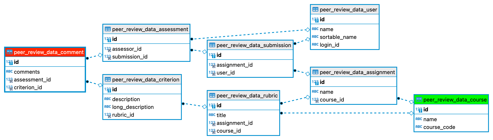

# peer-review-data

Extract LMS peer review data for analysis by external applications.

## Running

### Development

Use Docker compose to run in a local development environment.

1. Copy `config/.env.sample` to `.env` in the root directory of the project.
   Edit the file to replace the values contained therein with valid ones for
   the test environment. Refer to comments in the file as guides to the
   appropriate values.

    ```sh
    cp config/.env.sample .env
    vim .env
    ```

2. Use Docker's `compose` tool to run the application after building it. The
   application will query the Canvas course(s) specified in `.env` and save
   data from all of the peer-reviewed assignments to the database.

    ```sh
    docker compose up --build
    ```

3. Examine the data in the database, referring to the model diagram below. To
   connect to the database, make a MySQL or MariaDB connection with the
   following parameter values, most of which come from `docker-compose.yaml`:
    * Host: `localhost` (because Docker is running on the local computer)
    * Port: `5555` (via `.services.db.ports`)
    * Database: `peer-review-data`
    * Username: `peer-review-data`
    * Password: `peer-review-data_pw`

## Resources

### Database Model Diagram



### Canvas API functions

1. `/api/v1/courses/<course_id>` — canvasapi.canvas.Canvas.get_course()
2. `/api/v1/courses/<course_id>/assignments/<assignment_id>` —
   canvasapi.course.Course.get_assignment()
3. `/api/v1/courses/<course_id>/rubrics/<rubric_id>` —
   canvasapi.course.Course.get_rubric()
4. `/api/v1/courses/<course_id>/assignments/<assignment_id>/submissions` —
   canvasapi.assignment.Assignment.get_submissions()
5. `/api/v1/courses/<course_id>/search_users` —
   canvasapi.course.Course.get_users()
